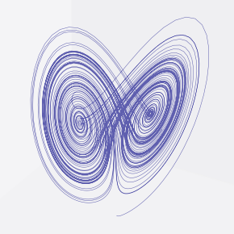

.. githubpages documentation master file, created by
   sphinx-quickstart on Sat Mar 18 00:21:20 2023.
   You can adapt this file completely to your liking, but it should at least
   contain the root `toctree` directive.

**narumind**
==============
(★) : Hot article

Dashboard
~~~~~~~~~~

#. Weather forecast

   .. image:: ./figures/forecast-short.png
      :align: center
      :width: 1000

   - wmo code (https://www.nodc.noaa.gov/archive/arc0021/0002199/1.1/data/0-data/HTML/WMO-CODE/WMO4677.HTM)
   - Weather data by Open-Meteo.com<https://open-meteo.com/> 

   .. raw:: html

      <iframe src="./src/dashboard/forecast_text.html" width="100%" height="100%" position="fixed"></iframe>

   - Text generated from ChatGPT API (GPT-3.5).

   
#. Market
   
   .. image:: ./figures/candlechartUSDJPY.png
      :align: center
      :width: 1000

   - Data from Financial Modeling Prep API. 

.. toctree::
   :maxdepth: 2
   :hidden:
   ./src/dashboard/dashboard.rst

.. raw:: html

   <a class="show-more" href="./src/dashboard/dashboard.html"> >>Show more</a>

  
Topic 
~~~~~~~~~~~~~

.. toctree::
   :maxdepth: 2
    
   ./src/theme/miscellaneous.rst
   ./src/theme/morningsatelite.rst
   ./src/theme/chatgpt_papers.rst
   ./src/theme/stablediffusion_papers.rst
   ./src/theme/zerotoone.rst

.. raw:: html

   <a class="show-more" href="./src/theme/index.html"> >>Show more</a>

.. toctree::
   :maxdepth: 2
   :hidden:

   ./src/theme/index.rst

Mathematics
~~~~~~~~~~~~~
.. toctree::
   :maxdepth: 1

   ./src/mathematics/stochasticcalculus/index

Engineering
~~~~~~~~~~~~~
.. toctree::
   :maxdepth: 1
   
   ./src/kit/2020-03-13-arduino-network-lamp.rst
   ./src/effectivecsharp/index.rst
   ./src/softwareengineering/index.rst
   ./src/MLApp/index.rst

Econ&Finance
~~~~~~~~~~~~~~~~
.. toctree::
   :maxdepth: 1

   ./src/econ/securitiestradelifecycle/index.rst
   ./src/econ/deephedge/index.rst
   ./src/econ/regulations/frtb.rst
   ./src/econ/regulations/benchmarkreform.rst
   ./src/econ/topic/finance_topic.rst
   ./src/econ/topic/marketresearch.rst
   ./src/econ/quantlib/index.rst
   ./src/econ/structuring/index.rst

   

Neuroscience
~~~~~~~~~~~~~
.. toctree::
   :maxdepth: 1

   ./src/neuroscience/index.rst

Tips
~~~~~
.. toctree::
   :maxdepth: 1

   ./src/Tips/sphinx-tips.rst
   ./src/excel/index.rst
   ./src/Tips/tennis.rst
   ./src/Tips/todo.rst

Indices and tables
~~~~~~~~~~~~~~~~~~~

* :ref:`genindex`
* :ref:`modindex`
* :ref:`search`

