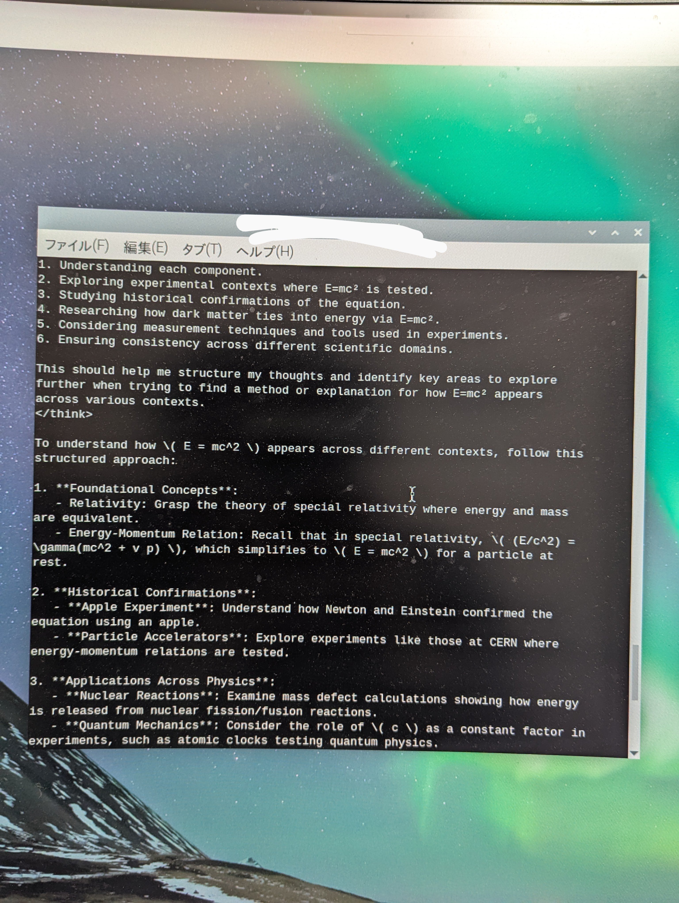
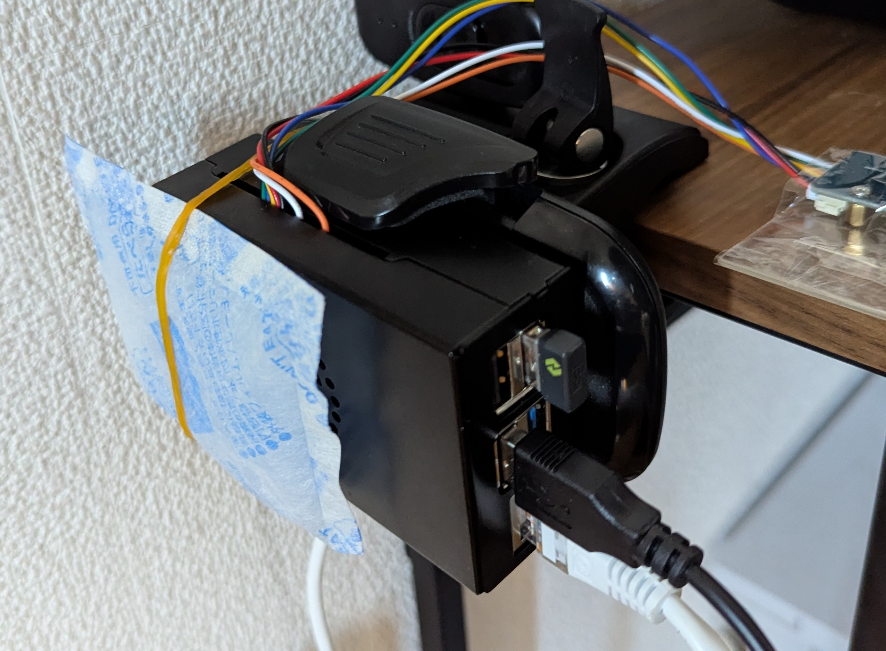

Dexter and Raspbery Pi(★)
=============================

Dexterとは何か

::

   

::

  

.. figure:: emc2part1.mp4
   :align: center
   :width: 320px
   :height: 480px
   :name: figure

かなり思考が長い。5分後くらいの状況：

.. figure:: emc2part2.mp4
   :align: center
   :width: 320px
   :height: 480px
   :name: figure

最終的にはthinkが終わり、答えを出している。

しばらく処理させていると、cpuが80度超えることがあったため(vcgencmd measure_tempでわかる)、その場しのぎとして保冷剤を使ってみた。（もちろん冷却ファンも内部でつけているが不十分。）

一定程度効果があることが分かり、つけない場合と比べて温度の立ち上がりは小さくなった。

